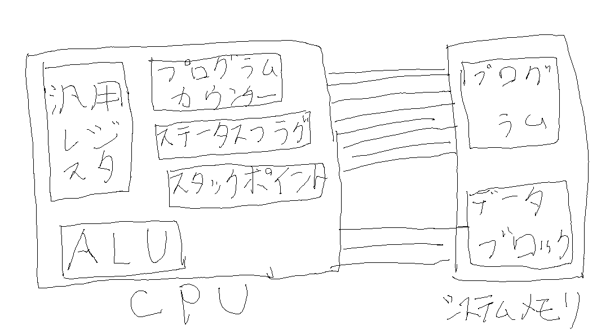

import SEO from '../../components/Seo';

<SEO
  description="論理回路について"
  title="論理回路"
  keywords={['logic circuit']}
/>

# CPU

CPUとはメモリからロードしたプログラムを実行する装置を指します。

CPUは複数の構成要素から成り立っています。

上記の図はCPUの構成要素を図示したものです。

汎用レジスタ: CPUでの計算結果を一時的に保存出来る記憶装置。システムメモリより高速なに動作する。

ALU: オペコードとオペランドを受け取り、その命令を実行する装置。オペランドが含まれない命令も存在する。

プログラムカウンター: 次に読み込むプログラムのアドレスを記憶する装置。

スタックポイント: LIFOと呼ばれるデータ構造(スタック)が格納されているメモリのアドレスを保持する。